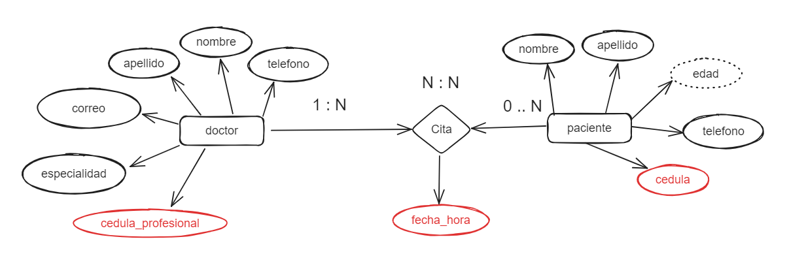
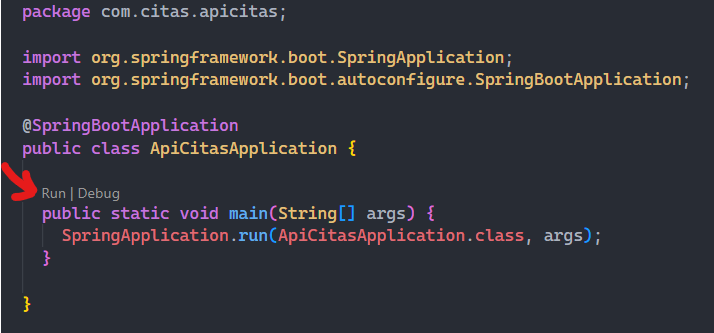

# eps-udistrital-express

## ¿Qué contiene este repositorio?
Aquí puedes encontrar un ejemplo de API REST para una EPS en donde se gestionan pacientes, doctores y citas.

El proyecto hace parte del curso de backend intermedio de la Universidad Distrital en convenio con ATENEA.

## Tecnologías usadas:

- [Java](https://www.oracle.com/java/)
- [Maven](https://maven.apache.org/)
- [Spring Boot](https://spring.io/projects/spring-boot)
- [MySQL](https://dev.mysql.com/doc/)

## Modelo Entidad Relación (MER)


## Ejecutar el proyecto

### 1. Clonamos el repositorio usando estos comandos en la terminal:

```
git clone https://github.com/Davida4200/eps-springboot-mysql.git
$ cd eps-springboot-mysql/
```

### 2. Instalación de dependencias:
```
mvn clean install
```

### 3. Reemplazar variables de entorno:
En la carpeta **/resources** está el archivo **application.propperties**. Aquí reemplazas las variables de entorno que desees usar en tu proyecto.

### 4. Ejecutar el proyecto:
En el archivo **ApiCitasApplication.java** debes ejecutar el proyecto presionando en **Run**.


### 5. Importar la colección de postman:
En la carpeta raíz del repositorio se encuentra el archivo `citas-express.postman_collection.json`.
Este archivo debes importarlo en tu postman y tendrás la colección base de esta API, recuerda que se trabaja con **Mysql** y se usan llaves foráneas, por lo que debes crear primero ***pacientes y doctores***, luego ***citas***.

## Endpoints disponibles:

### Endpoint de Pacientes:

- `GET` - `/api/pacientes/`: Obtiene todos los pacientes.
- `GET` - `/api/pacientes/{id}`: Obtiene un paciente específico por ID.
- `POST` - `/api/pacientes/`: Agrega un nuevo paciente.
- `PUT` - `/api/pacientes/{id}`: Modifica un paciente existente por ID.
- `DELETE` - `/api/pacientes/{id}`: Elimina un paciente existente por ID.

### Endpoint de Doctores:

- `GET` - `/api/doctores/`: Obtiene todos los doctores.
- `GET` - `/api/doctores/{id}`: Obtiene un doctor específico por ID.
- `GET` - `/api/doctores/especialidad/{especialidad}`: Obtiene doctores por especialidad.
- `POST` - `/api/doctores/`: Agrega un nuevo doctor.
- `PUT` - `/api/doctores/{id}`: Modifica un doctor existente por ID.
- `DELETE` - `/api/doctores/{id}`: Elimina un doctor existente por ID.

### Endpoint de Citas:

- `GET` - `/api/citas/`: Obtiene todas las citas.
- `GET` - `/api/citas/one-cita`: Obtiene una cita específica por ID de paciente, ID de doctor y fecha/hora.
- `POST` - `/api/citas/`: Agrega una nueva cita.
- `PUT` - `/api/citas/`: Modifica una cita existente.
- `DELETE` - `/api/citas/`: Elimina una cita existente.


## Probando la API
Puedes ver como se hace la prueba de la API en este [link](#).
> **Nota:** Falta añadir el video de pruebas.